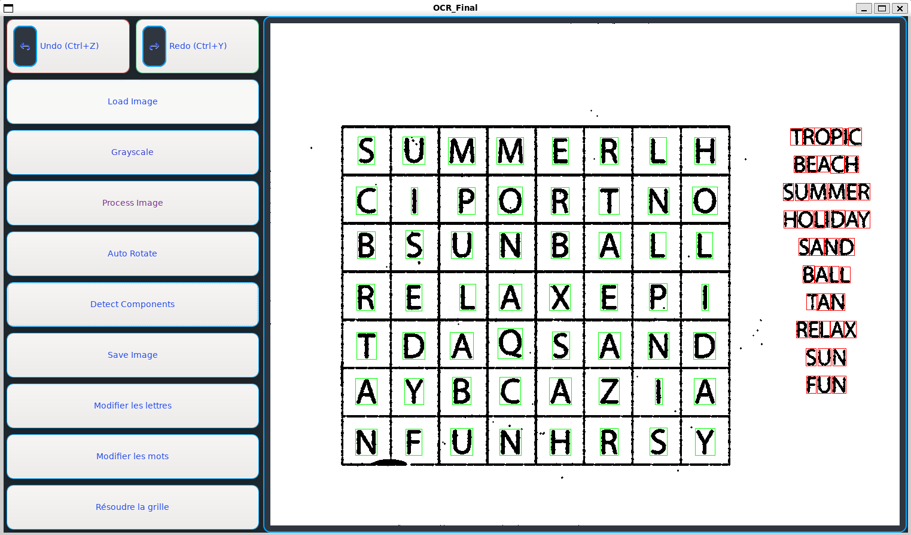
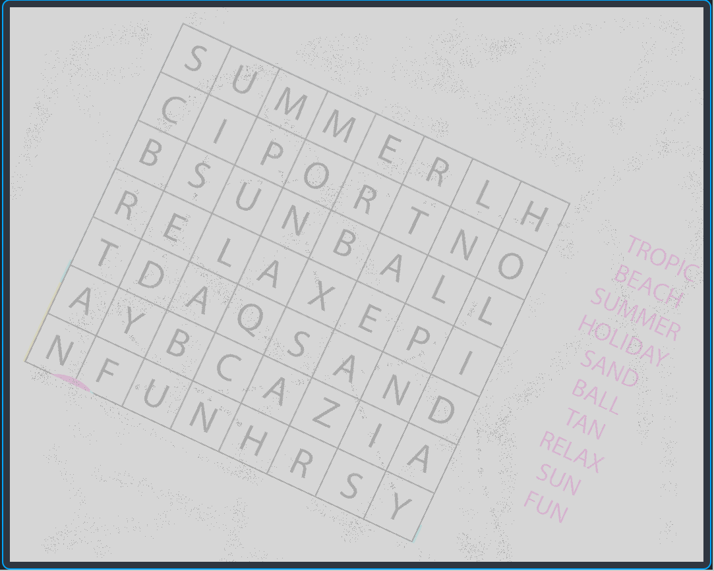
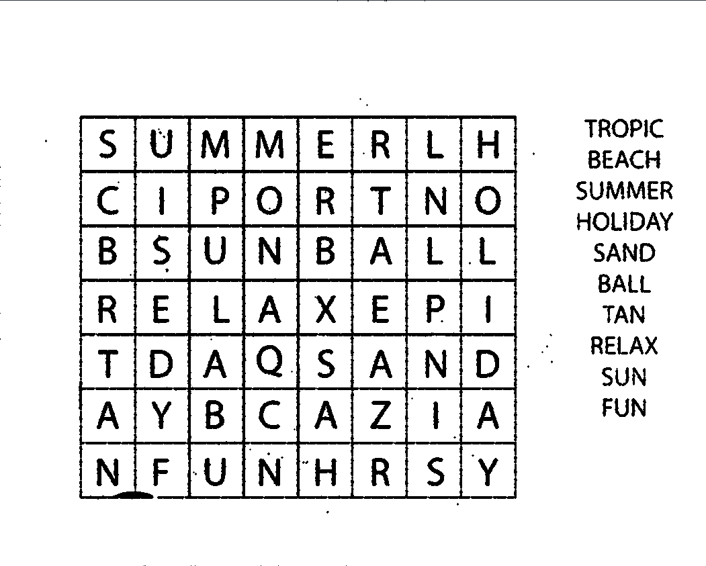
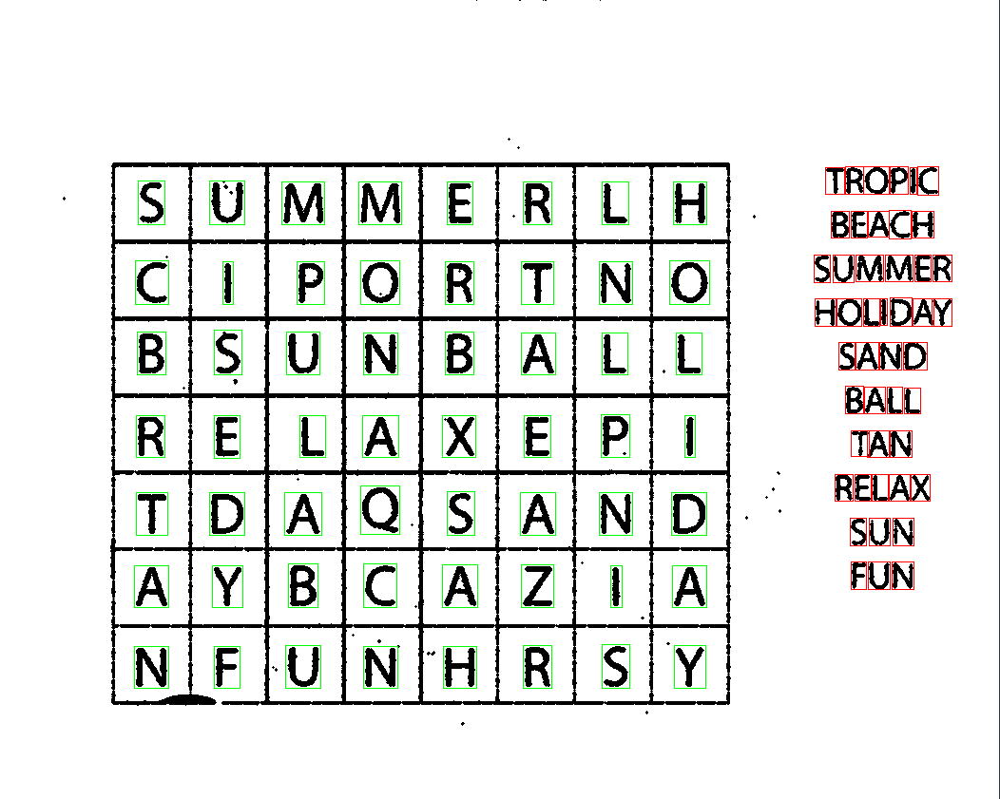
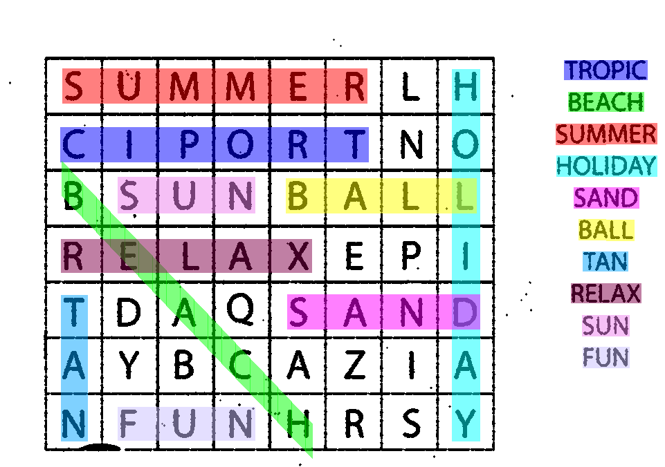

# 🔍 OCR Word Search Solver (C / GTK / CNN)

> **Note:** The source code for this project (developed at EPITA) is kept private to comply with the school's anti-plagiarism policies. This page serves as a visual showcase of our algorithm's workflow.

This project is an Optical Character Recognition (OCR) engine built entirely from scratch in **C** (without OpenCV), capable of reading a word search puzzle from a raw image and solving it.

---

## 📸 The Processing Pipeline (How it works)

### 1. Graphical User Interface (GTK3)
We developed a complete user interface in C/GTK3 allowing users to load an image and apply the different algorithms step by step.

  

### 2. Image Preprocessing (Filters)
The raw image undergoes several transformations: grayscale conversion, Gaussian blur, Otsu's binarization, and noise reduction to highlight the black ink.

  
  

### 3. Segmentation (Connected Components)
Our detection algorithm isolates the grid area (green bounding boxes) and extracts each letter individually (red bounding boxes).

  

### 4. Artificial Intelligence & Solving Algorithm
Each extracted letter is analyzed by our custom-built **Convolutional Neural Network (CNN)**. Once the virtual grid is recreated in memory, our solver scans all 8 possible directions, finds the hidden words, and highlights them directly on the original image.

  

---
**🛠️ Technologies:** C, GTK3, Make, Bash, Git.
