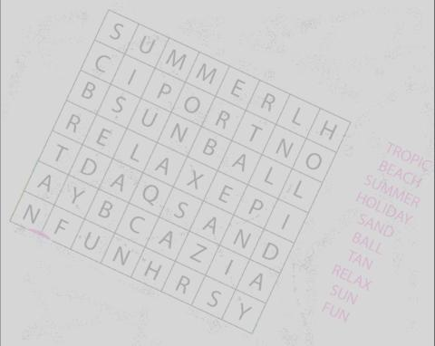
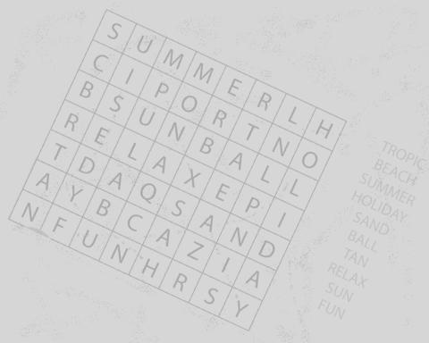

# OCR Word Search Solver - C Neural Network

> **Showcase Repository:** To comply with EPITA's anti-plagiarism regulations, the raw source code of this project is kept private. This repository serves as an architectural showcase documenting the neural network design, the image processing pipeline, and the solver logic.

## 📖 Project Context

**OCR Word Search Solver** is a second-year engineering project developed at EPITA. The objective was to build a complete Optical Character Recognition (OCR) software from scratch in C to automatically read and solve word search grids from images.

**My Role:**
- Implemented image preprocessing pipeline to prepare raw images for OCR.
- Extracted individual characters and arranged them into a grid matrix.
- Developed the solver to find words from the list within the character matrix.
- Highlighted the found words directly on the original image.
- Collaborated with the AI developer by providing the processed matrices for neural network recognition.

## 🏗️ Technical Architecture & Features

The project is structured around a classic OCR pipeline, entirely developed without external computer vision or machine learning libraries (except for basic UI/Image loading).

### 1. Image Processing Pipeline
* **Preprocessing:** Handles raw images of varying quality. Includes grayscale conversion, contrast enhancement, and noise reduction.
* **Binarization & Rotation:** Dynamically adjusts the image rotation to ensure the grid is perfectly aligned, followed by adaptive binarization to separate the text from the background.
* **Segmentation:** Detects the grid boundaries and isolates each individual character into a standardized matrix to feed into the neural network.

### 2. Custom Artificial Neural Network (My Core Contribution)
To recognize the extracted characters, I built a Multi-Layer Perceptron (MLP) entirely from scratch in C.
* **Architecture:** Feedforward neural network with customizable hidden layers.
* **Training Logic:** Implemented the Backpropagation algorithm, including gradient descent and weight adjustments.
* **Activation & Loss:** Coded standard activation functions (Sigmoid/Softmax) and error calculation to train the model on a dataset of uppercase characters.

### 3. Algorithmic Solver & GUI
* **Grid Resolution:** Once the grid of characters is generated by the AI, an optimized search algorithm scans the 2D matrix in all 8 directions to find the list of hidden words.
* **Graphical Interface:** A fluid UI allows users to intuitively load an image, visualize the processing steps (binarization, grid detection), and display the solved puzzle.
* **Showcase Website:** A dedicated companion website was developed to present the project, the team, and the underlying technology.

## 🎯 Demonstration (Computer Vision Pipeline)

The engine processes raw images through a strict computer vision pipeline before feeding the extracted characters to the Neural Network.

| Step 1: Original Image | Step 2: Grayscale | Step 3: Binarization |
|:---:|:---:|:---:|
|  |  |  |

| Step 4: Auto-rotate | Step 5: Detect Components | Step 6: Final Resolution |
|:---:|:---:|:---:|
|  |  |  |

## 🌐 Project Website (French)
You can learn more about the development process on our dedicated project website:
[*(OCR Word Search Solver Website)*](https://projet-ocr.netlify.app/)

## 👥 Contributors

This project was developed by a team of 3 EPITA engineering students.

  <table>
    <tr>
      <td align="center">
        <a href="https://github.com/jessim-ziani">
           
          <b>Jessim Ziani</b>
        </a>
      </td>
      <td align="center">
        <a href="https://github.com/Wael-Akhdar">
           
          <b>Wael Akhdar</b>
        </a>
      </td>
      <td align="center">
        <a href="https://github.com/youcefzahra">
           
          <b>Youcef Zahra</b>
        </a>
      </td>
    </tr>
  </table>

---
**🛠️ Technologies:** C, GTK3, Make, Bash, Git.
